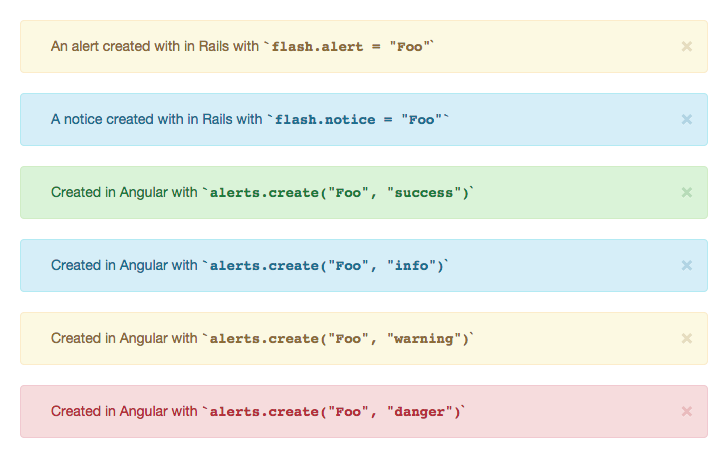

# ng-bootstrap-alerts

`ng-bootstrap` alerts is a service for displaying Rails-style `flash` notifications
as [Bootstrap alerts](http://getbootstrap.com/components/#alerts).

## Installation

In your Angular project, run `bower install --save ng-bootstrap-alerts` to save the module.
Then, in your HTML, add the script tag for `ng-bootstrap-alerts`:

``` html
<script src="/path/to/bower_components/ng-bootstrap-alerts/index.min.js"></script>
```

And lastly, in your Angular module, include `ng-bootstrap-alerts` as a dependency:

``` javascript
angular.module('my-app', ['ng-bootstrap-alerts')
```

## Usage

### TL;DR

If you use Rails' flash messages, add the alert placeholder to the top of your
page:

``` html
<alert-list></alert-list>
```

And then load any flash alerts into our `alertsProvider`

``` html
<script>
  angular.module('ng-bootstrap-alerts').config(function(alertsProvider) {
    <% flash.each do |type, msg| -%>
      alertsProvider.queue('<%= msg %>', '<%= type %>')
    <% end -%>
  })
</script>
```

And lastly, while your app is running, you can create alerts on the fly with:

``` javascript
  angular.module('my-app').run(function(alerts) {
    alerts.create('This is really important!!', 'danger')
  })
</script>
```


### Alert types

Alerts have a type corresponding to the list of [Bootstrap alert types](http://getbootstrap.com/components/#alerts),
but we also coerce a couple of common of Rails flash types into Bootstrap types:



## API

### `alertsProvider#queue(message, type [, optionsObject])`

The `alertsProvider` service has one method `queue`, which allows you to, at
config-time, preload alerts, with an optional type:

``` javascript
angular.module('ng-bootstrap-alerts').config(function(alertsProvider) {
  alertsProvider.queue('This is my alert!')
  alertsProvider.queue('This is my warning!', 'warning')
})
```

#### Supported options
- `dismissAfter: intMilliseconds`  
  Automatically dismisses the alert after a number of milliseconds

### `alerts#create(message, type [,optionsObject])`

The `alerts` service's `create` method, lets you do the same during your app's
run cycle:

``` javascript
angular.module('ng-bootstrap-alerts').run(function(alerts) {
  alerts.create('This is my alert!')
  alerts.create('This is my warning!', 'warning')

  // HTML is also supported
  alerts.create('<a class="alert-link">Click me!</a>', 'info')
})
```

#### Supported options
- `dismissAfter: intMilliseconds`  
  Automatically dismisses the alert after a number of milliseconds

### `alerts#dismiss(alert)`
The `dismiss` method, lets you remove an existing alert from the page:

``` javascript
angular.module('ng-bootstrap-alerts').run(function($timeout, alerts) {
  alert = alerts.create('This alert will self-destruct in 5...', 'warning')

  // Somewhere else in the world.
  form.on('submit', function() { alerts.dismiss(alert) })
})
```

### The `alert-list` directive
Lastly, the alert-list directive will display the any alerts in the `alerts`
service:

``` html
<body>
  <alert-list></alert-list>
  <!-- When alerts are created, they'll now appear above the site title -->

  <h1> My awesome site!</h1>
</body>
```

## Contributing

To get your dev environment up and running, run `npm install` and `bower install`
to get the components we need.

Tests are run with `npm run test` against the minified source (to catch
Angular annotation errors). You can build the minified file as you work by
running `npm run build:watch`

Releases are built using `npm run release:[type]`. So, to generate a new patch
release, run `npm run release:patch`. This script will:

* Generate minified, concatenated JS files,
* Increment the version in `bower.json`
* Tag a new release

